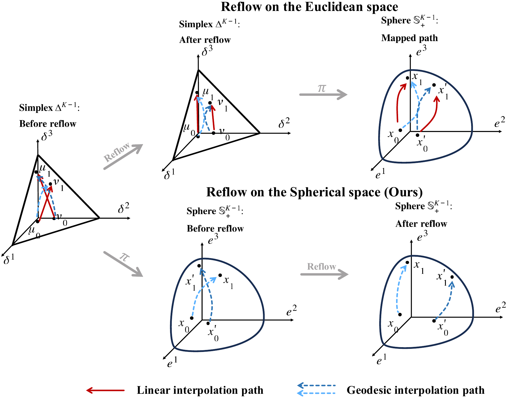

# ReSFlow: Rectified Statistical Flow

**Rectifying Categorical Flows on Statistical Manifolds for One-Step Generation**

Xiaohuan Jia · Renzhe Xu · Xiao Wang · Jiayun Wu · Shaohua Fan

ReSFlow performs flow matching for categorical data under Fisher–Rao geometry and rectifies the learned trajectories on the sphere. After reflow, generation uses a single vector-field evaluation followed by a spherical exponential-map update.

[Overview](#overview) · [Installation](#installation) · [Data](#data) · [Training and evaluation](#training-and-evaluation) · [Citation](#citation)

## Overview



Categorical distributions lie on the probability simplex. ReSFlow maps them to the positive orthant of the unit sphere through the square-root map, learns a tangent vector field, and performs reflow using spherical geodesics. The square-root map preserves Fisher–Rao geometry up to a constant scale factor.

The pipeline has three stages:

1. **Train a base flow** with geodesic interpolation between independent prior and data samples.
2. **Reflow** by generating endpoint pairs with the previous flow and fine-tuning on geodesic paths between those endpoints.
3. **Generate in one step** with the learned initial velocity and the exponential map, then map back to categorical probabilities and decode the discrete states.

For a simplex prior $\mu_0$, the one-step spherical update is

$$
X_0=\sqrt{\mu_0},\qquad
\widehat X_1=\mathrm{Exp}_{X_0}\!\left(v_\theta(X_0,0)\right),\qquad
\widehat\mu_1=\widehat X_1^{\,2}.
$$

In the run configurations, `run.method: euler` with `run.n_steps: 1` selects this exponential-map update for spherical models. It selects a Euclidean update for linear models.

### Controlled variants

| Method | Geometry | Training procedure | `model.type` |
| --- | --- | --- | --- |
| LinearFM | Euclidean simplex | Base flow matching | `linear` |
| SFM | Sphere | Base flow matching | `sphere` |
| R-LFM | Euclidean simplex | Base training + reflow | `linear` |
| ReSFlow | Sphere | Base training + reflow | `sphere` |

Use the task commands below for base training and rectification. All provided `*_reflow.yml` files use `model.type: sphere`. To run linear variants, copy the matching configs and change `model.type` to `linear` in both base and reflow configs. Keep all other settings matched for a controlled comparison.

## Installation

```bash
# Linux x86_64 (glibc >= 2.28), NVIDIA driver compatible with CUDA 12.8
git clone https://github.com/xiaohuanjia/ReSFlow.git
cd ReSFlow
conda env create -f env_lightning.yml
conda activate ReSFlow
```

| Experiment | GPU configuration |
| --- | --- |
| Swiss roll | CPU or 1 NVIDIA CUDA GPU |
| Binarized MNIST | 1 NVIDIA GeForce RTX 5090 |
| Text8 | 4 NVIDIA A800 GPUs |
| Promoter design | 1 NVIDIA CUDA GPU (model not specified) |

## Data

### Download and preprocess all datasets

```bash
python prepare_data.py --dataset all --data_root ./data
```

### Download and preprocess individual datasets

```bash
# Binarized MNIST
python prepare_data.py --dataset bmnist --data_root ./data

# Text8
python prepare_data.py --dataset text8 --data_root ./data

# Promoter design
python prepare_data.py --dataset promoter --data_root ./data
```

### Prepared files

```text
data/
├── bmnist/
│   ├── binarized_mnist_train.amat
│   ├── binarized_mnist_valid.amat
│   ├── binarized_mnist_test.amat
│   ├── binarized_mnist_train.npy
│   ├── binarized_mnist_valid.npy
│   └── binarized_mnist_test.npy
├── text8/
│   ├── text8.zip
│   ├── text8
│   ├── train.bin
│   ├── valid.bin
│   ├── test.bin
│   └── meta.pkl
└── promoter/
    ├── .downloads/
    │   └── data.tar.gz
    ├── Homo_sapiens.GRCh38.dna.primary_assembly.fa
    ├── Homo_sapiens.GRCh38.dna.primary_assembly.fa.fai
    ├── Homo_sapiens.GRCh38.dna.primary_assembly.fa.mmap
    ├── FANTOM_CAT.lv3_robust.tss.sortedby_fantomcage.hg38.v4.tsv
    ├── agg.plus.bw.bedgraph.bw
    ├── agg.minus.bw.bedgraph.bw
    ├── fantom.blacklist8.plus.bed.gz
    ├── fantom.blacklist8.plus.bed.gz.tbi
    ├── fantom.blacklist8.minus.bed.gz
    ├── fantom.blacklist8.minus.bed.gz.tbi
    ├── hg38.blacklist.bed.gz
    ├── hg38.blacklist.bed.gz.tbi
    ├── best.sei.model.pth.tar
    └── target.sei.names
```

## Training and evaluation

Run commands from the repository root. Each task has its own YAML configuration. The `run` section stores the checkpoint, sampler, split, sample count, and output paths; `extends` inherits the shared model and dataset settings from a file in the same directory. Update checkpoint paths in the task configuration to match your saved models.

### Binarized MNIST

```bash
# Train the spherical base model
python main.py configs/bmnist_train.yml

# Reflow from the base checkpoint
python main.py configs/bmnist_reflow_run.yml

# One-step inference
python main.py configs/bmnist_infer_1step.yml

# Adaptive ODE inference
python main.py configs/bmnist_infer_ode.yml

# Select checkpoints using validation-set FID
python select_best_model.py --config configs/bmnist_select_1step.yml
```

`select_best_model.py` creates `bmnist_valid_fid.npz` when needed. The selection configuration uses `logs/bmnist_sfm/100000.pt` to recover the model configuration. For notebook evaluation, edit checkpoint paths and sampler settings in `configs/bmnist_eval_notebook.yml`, then run:

```bash
jupyter notebook eval_bmnist.ipynb
```

The notebook follows the SFM layout: load models and data → precompute FID statistics → sample and evaluate. It reports one-step and ODE FID, sampling time, and measured NFE, and saves sample grids and per-seed metrics. It loads existing checkpoints and does not run training.

### Text8

```bash
# Train the spherical base model with PyTorch Lightning
python main_lightning.py configs/text8_sphere_lightning.yml

# Reflow from the trained Lightning base checkpoint
python main.py configs/text8_reflow_resume.yml

# One-step character generation
python sample_text8.py --config configs/text8_sample_1step.yml

# Adaptive ODE character generation
python sample_text8.py --config configs/text8_sample_ode.yml

# BPC evaluation on the test split
python eval_text8_bpc.py --config configs/text8_eval_bpc.yml
```

### Conditional promoter design

```bash
# Train the spherical base model
python main.py configs/promoter_train.yml

# Reflow from the base checkpoint
python main.py configs/promoter_reflow_run.yml

# One-step samples and timing
python sample_promoter.py --config configs/promoter_sample_1step.yml

# Adaptive ODE samples and timing
python sample_promoter.py --config configs/promoter_sample_ode.yml

# One-step Sei-based evaluation on the test split
python main.py configs/promoter_eval_1step.yml

# Adaptive ODE Sei-based evaluation on the test split
python main.py configs/promoter_eval_ode.yml
```

### Swiss roll

```bash
jupyter notebook swissroll_reflow.ipynb
```

Run the notebook cells in order to train the base flows, generate reflow pairs, fine-tune both rectified variants, and compare samples and likelihoods. Use ODE-based NLL for comparison with the paper.

## Citation

Please cite the accompanying manuscript when using ReSFlow:

```bibtex
@misc{jia2026resflow,
  title={Rectifying Categorical Flows on Statistical Manifolds for One-Step Generation},
  author={Jia, Xiaohuan and Xu, Renzhe and Wang, Xiao and Wu, Jiayun and Fan, Shaohua},
  year={2026}
}
```

## License

ReSFlow contributions are released under the [MIT license](LICENSE). Third-party components retain their original licenses; Sei code and weights are limited to academic and research use. See [third-party notices](THIRD_PARTY_NOTICES.md).
